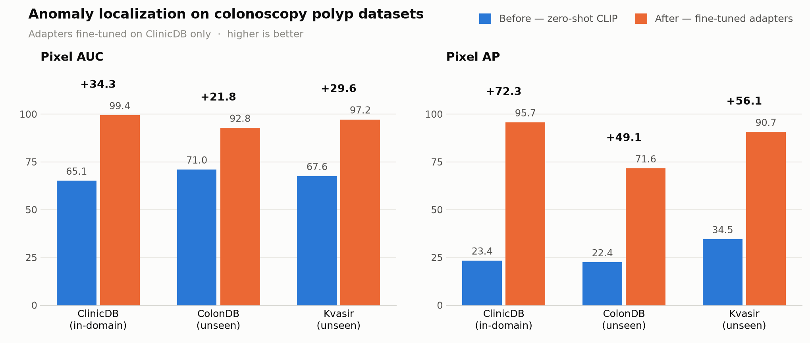
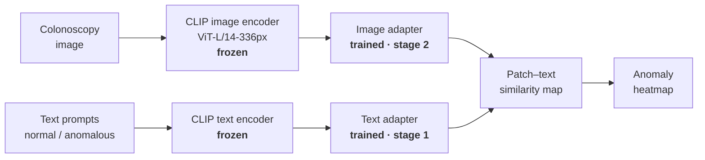
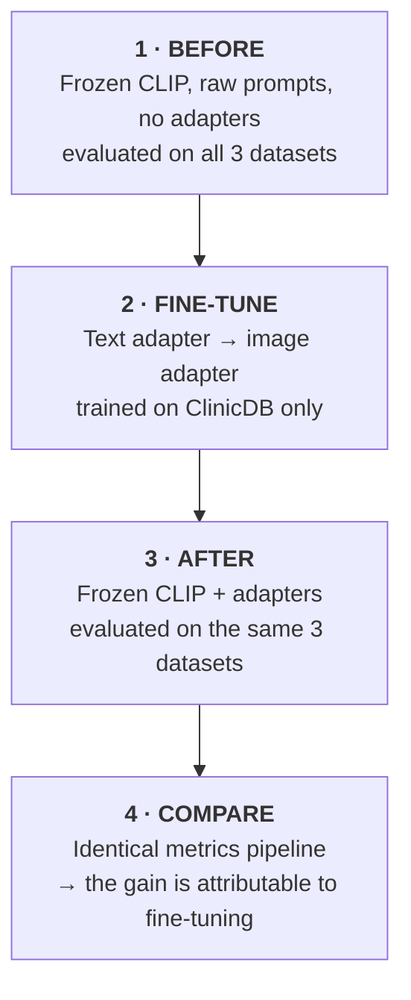
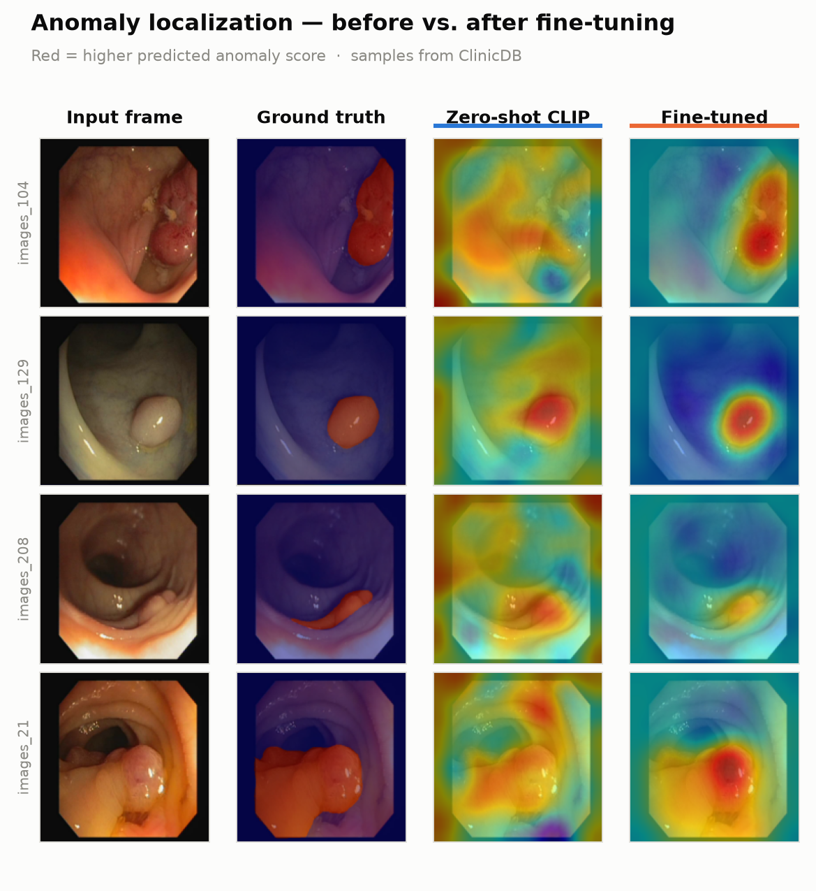

# Medical Image Anomaly Detection with AA-CLIP

Fine-tuning **AA-CLIP** adapters to localize polyps in colonoscopy images — with a
rigorous **before → fine-tune → after** experiment that measures exactly what the
fine-tuning bought.

[](https://colab.research.google.com/github/mohit6603/Medical_Image_Anomaly_Detection/blob/main/notebooks/medical_image_anomaly_detection_finetune_eval.ipynb)


---

## Headline result

Training lightweight adapters on **one** polyp dataset lifts anomaly localization
dramatically — and the gain **transfers to two datasets the model never saw**.

| | Pixel AUC | Pixel AP |
|---|---|---|
| **Unseen datasets, before** | 67.6 – 71.0 | 22.5 – 34.5 |
| **Unseen datasets, after** | **92.8 – 97.2** | **71.6 – 90.7** |
| **Gain** | **+21.8 to +29.6** | **+49.1 to +56.1** |



The jump in **pixel AP** is the striking one: zero-shot CLIP scores in the low 20s,
which is barely above chance for these masks. After fine-tuning it clears 70 on
unseen data and 90 on Kvasir.

---

## The problem

Anomaly detection in medical imaging suffers from a data shortage that ordinary
supervised segmentation cannot solve: annotated abnormal examples are scarce, and
every new imaging domain needs its own labels.

**Zero-shot** approaches sidestep this by reusing a vision-language model's
existing semantic knowledge — describe the anomaly in text, and match it against
image regions. CLIP is the obvious candidate, but out of the box it has a known
weakness: its image and text embeddings are **not anomaly-aware**. It knows what a
colon looks like; it does not reliably separate "normal tissue" from "polyp."

**AA-CLIP** (CVPR 2025) addresses this with a two-stage adapter scheme that makes
the embedding space anomaly-aware while leaving the CLIP backbone completely
frozen. This repository reproduces that method on colonoscopy polyp data and
quantifies the before/after difference under an identical metrics pipeline.

---

## Method

The CLIP backbone is **frozen throughout**. Only two small adapters train, which is
why the whole experiment fits in under an hour on a free-tier T4.



**Stage 1 — text adapter (5 epochs).** Pulls the "normal" and "anomalous" text
anchors apart so the two classes occupy genuinely distinct regions of embedding
space.

**Stage 2 — image adapter (10 epochs).** Aligns patch-level image features to
those separated anchors, so a patch containing a polyp lands near the anomalous
anchor and healthy mucosa lands near the normal one.

At inference, every patch embedding is compared against both text anchors; the
resulting similarity map, upsampled to image resolution, *is* the anomaly heatmap.

### Experiment design



Both evaluation modes run through the **same script** (`evaluate.py`, generated by
the notebook) and the **same metric functions**, so the before/after numbers are
directly comparable rather than two separate pipelines that happen to print
similar-looking tables.

---

## Datasets

Three colonoscopy polyp datasets ship with the upstream repository:

| Dataset | Images | Role | Seen during training? |
|---|---|---|---|
| `Colon_clinicDB` (CVC-ClinicDB) | 612 | Train + in-domain eval | ✅ Yes |
| `Colon_colonDB` (CVC-ColonDB) | 380 | Cross-dataset eval | ❌ No |
| `Colon_Kvasir` (Kvasir-SEG) | 1000 | Cross-dataset eval | ❌ No |

Every image carries a pixel-level ground-truth polyp mask.

> [!IMPORTANT]
> **Read the ClinicDB row as a sanity check, not as a result.** The upstream repo
> uses the same image list for training and testing on that dataset, so its
> after-scores are in-domain and optimistic by construction. **ColonDB and Kvasir
> are the honest numbers** — they are never touched during training, so their
> improvement measures real zero-shot generalization, which is precisely the claim
> AA-CLIP makes.

---

## Evaluation metrics

| Metric | What it measures | Used? |
|---|---|---|
| **Pixel AUC** | Ranking quality of per-pixel anomaly scores against the mask | ✅ Primary |
| **Pixel AP** | Area under precision–recall, per pixel | ✅ Primary |
| Image AUC / AP | Whether a *whole image* is anomalous | ❌ Degenerate here |

> [!NOTE]
> **Why image-level metrics are reported as 0.** These polyp datasets contain
> *only* anomalous images — every sample has label 1. A classification metric
> needs both classes to be meaningful, so image AUC/AP are undefined and the
> evaluation code emits 0. They are not failures; they are simply not applicable.
> **Anomaly localization** — pixel AUC and pixel AP — is the real task here.

Both metrics are rank-based, which matters: the raw zero-shot similarity scores
are on a different scale than the trained model's outputs, but rank-based metrics
compare the two fairly without any score calibration.

---

## Results

### Before fine-tuning — zero-shot frozen CLIP

| Dataset | Pixel AUC | Pixel AP |
|---|---|---|
| Colon_clinicDB | 65.14 | 23.36 |
| Colon_colonDB | 70.99 | 22.45 |
| Colon_Kvasir | 67.56 | 34.54 |

### After fine-tuning — adapters trained on ClinicDB

| Dataset | Pixel AUC | Pixel AP |
|---|---|---|
| Colon_clinicDB | 99.41 | 95.67 |
| Colon_colonDB | 92.80 | 71.56 |
| Colon_Kvasir | 97.18 | 90.67 |

### Before vs. after

| Dataset | Pixel AUC before → after | Δ | Pixel AP before → after | Δ |
|---|---|---|---|---|
| `Colon_clinicDB` *(in-domain)* | 65.14 → 99.41 | **+34.27** | 23.36 → 95.67 | **+72.31** |
| `Colon_colonDB` *(unseen)* | 70.99 → 92.80 | **+21.81** | 22.45 → 71.56 | **+49.11** |
| `Colon_Kvasir` *(unseen)* | 67.56 → 97.18 | **+29.62** | 34.54 → 90.67 | **+56.13** |

**Reading the numbers.** Zero-shot CLIP lands around 65–71 pixel AUC — better than
random, but its pixel AP in the low 20s shows it is not actually localizing
polyps so much as weakly correlating with them. After fine-tuning, unseen-dataset
AP more than triples. Kvasir (+56.1 AP) generalizes better than ColonDB (+49.1
AP), which is consistent with Kvasir's larger, higher-contrast polyps being
visually closer to ClinicDB's than ColonDB's smaller, flatter lesions are.

---

## Qualitative results

Each row is one ClinicDB frame: the input, the ground-truth mask overlay, and the
predicted heatmap before and after fine-tuning.



The failure mode of zero-shot CLIP is visible immediately: its heatmaps are
**diffuse and drawn to image borders, specular highlights, and lumen edges** —
high-contrast structures that are not the anomaly. After fine-tuning, activation
collapses onto the polyp itself and the surrounding mucosa goes cold. Row 2
(`images_129`) is the cleanest example: a scattered warm smear becomes a single
tight hotspot centered on the lesion.

---

## Repository contents

```
.
├── notebooks/
│   └── medical_image_anomaly_detection_finetune_eval.ipynb   # end-to-end experiment
├── assets/                                                   # figures used in this README
├── requirements.txt                                          # local notebook dependencies
└── .gitignore                                                # excludes datasets, checkpoints, results
```

The notebook is the deliverable. It clones the upstream implementation, patches
it, trains, evaluates, and produces every figure above — 15 sections, runnable
top to bottom.

---

## Quick start

### Google Colab (recommended)

Click the Colab badge above, then set **Runtime → Change runtime type → T4 GPU**
and run all cells. Everything else — cloning, dependencies, the backbone
download, dataset paths — is handled by the notebook.

### Local

Requires a CUDA-capable GPU with ≥ 12 GB of memory.

```bash
python -m venv .venv
source .venv/bin/activate
pip install -r requirements.txt
jupyter notebook notebooks/medical_image_anomaly_detection_finetune_eval.ipynb
```

---

## What the notebook does

| § | Step |
|---|---|
| 1–3 | GPU check, clone upstream repo, install Colab-compatible dependencies |
| 4 | Download the CLIP ViT-L/14-336px backbone (~890 MB) |
| 5 | Repoint the dataset config at the bundled polyp data |
| 6 | Apply two compatibility patches (see below) |
| 7 | Select the training dataset and evaluation datasets |
| 8 | Generate `evaluate.py` — one script, two modes, identical metrics |
| 9 | **BEFORE**: zero-shot baseline on all three datasets |
| 10 | **Fine-tune**: two-stage adapter training |
| 11 | **AFTER**: adapted-model evaluation on the same three datasets |
| 12–13 | Comparison table, bar chart, side-by-side heatmaps |
| 14–15 | Optionally persist results to Drive; optional all-dataset sweep |

### Compatibility patches

The upstream code needs two fixes, both applied idempotently with `.bak` backups:

1. **`test.py` — pandas incompatibility.** `df.mean()` over a mixed-type DataFrame
   raises on modern pandas. Patched to coerce numerics before averaging.
2. **`forward_utils.py` — visualization.** `visualize()` only built filenames for
   MVTec and raised `NotImplementedError` for every other dataset, and it
   converted images to RGB before writing them with `cv2.imwrite()` (which expects
   BGR, swapping red and blue). **Required** for the heatmaps above.

A third fix is environmental: the upstream pin `opencv-python==4.9.0.80` was built
against NumPy 1.x and breaks on Colab's NumPy 2.x, so the notebook upgrades to
`opencv-python>=4.10`.

---

## Training configuration

| Setting | Value | Why |
|---|---|---|
| Backbone | CLIP ViT-L/14-336px | Frozen; only adapters train |
| Training mode | `full_shot` | Uses all 612 ClinicDB images |
| Text adapter epochs | 5 | Stage 1 |
| Image adapter epochs | 10 | Stage 2 — upstream default is 20; these small, homogeneous datasets converge sooner |
| Image batch size | 2 | 8 and 16 both OOM on a T4 (see below) |
| Image size | 336 | Matches the backbone's native resolution; upstream default 518 |
| Allocator | `expandable_segments:True` | Reduces fragmentation near the memory ceiling |

> [!WARNING]
> **Batch size 2 is not a typo.** Two full ViT-L/14 copies (`clip_surgery` and
> `clip_model`) plus optimizer state consume nearly all 14.6 GB of a T4 before
> batch size is even a factor. Batch sizes of 8 and 16 both fail with CUDA OOM.
> Reducing `--img_size` from 518 to 336 also cuts per-image compute, at the cost
> of coarser localization on small lesions — **keep `--img_size` in sync between
> training and evaluation.**

`train.py` **auto-resumes**: it scans `--save_path` for existing adapter weights
and restarts from the last completed epoch of each stage, so an interrupted
Colab session can be recovered by simply re-running the cell.

### Measured runtime — Tesla T4 (15 GB), Google Colab

| Phase | Time |
|---|---|
| Text adapter, 5 epochs | ~15 min (≈3 min/epoch) |
| Image adapter, 10 epochs | ~43 min (≈4 min 20 s/epoch) |
| Evaluation, all 3 datasets, one mode | ~4.5 min |
| **Total, end to end** | **~1 hour** |

Excludes the one-time ~890 MB backbone download.

---

## Limitations

- **ClinicDB scores are in-domain.** Train and test use the same image list
  upstream. Only ColonDB and Kvasir measure generalization.
- **One anatomy, one modality.** Results cover colonoscopy polyps only; they do
  not transfer automatically to brain, liver, or retinal imaging.
- **No image-level detection.** The bundled datasets have no normal images, so
  this work evaluates *localization* only, not whether an image is abnormal.
- **Single run.** Numbers come from one seed; no variance estimates.
- **Not a clinical tool.** Research reproduction only — not validated for
  diagnostic use.

---

## Acknowledgements

- **AA-CLIP: Enhancing Zero-shot Anomaly Detection via Anomaly-Aware CLIP** (CVPR 2025) — the method reproduced here.
- [Jinali-Shah5/Medical-Image-Anomaly-Detection](https://github.com/Jinali-Shah5/Medical-Image-Anomaly-Detection) — the implementation this notebook drives.
- [OpenAI CLIP](https://github.com/openai/CLIP) — ViT-L/14-336px backbone.
- Datasets: CVC-ClinicDB, CVC-ColonDB, and Kvasir-SEG, as bundled upstream.

Dataset and upstream-code licenses are held by their respective authors; consult
those sources before any redistribution or downstream use.
